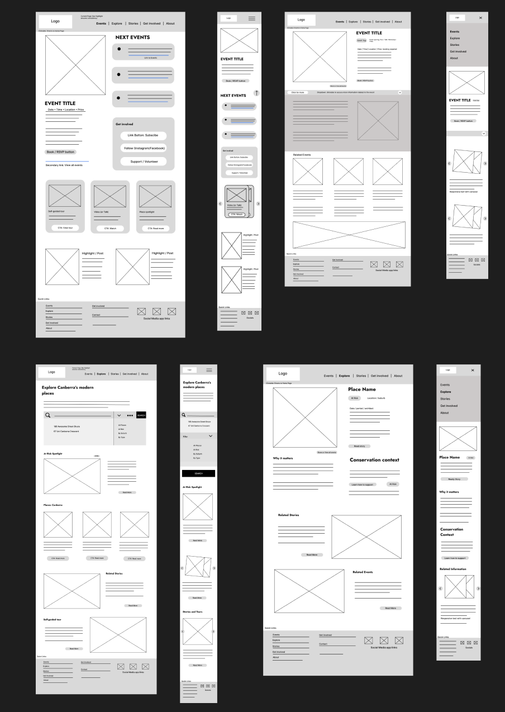
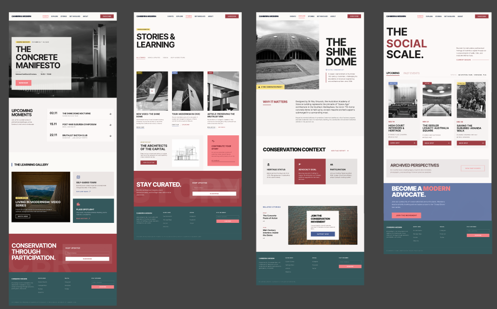

# Canberra Modern Website

## Project overview

This project is a responsive website for Canberra Modern, a volunteer organisation focused on Canberra's modernist built heritage. I treated the site as an editorial heritage platform rather than only an events listing. The final site helps users discover significant places, attend events, read stories, and support conservation work.

The website is built as a multi-page site using HTML, CSS, and basic JavaScript. It includes eight main pages: Home, Events, Event Detail, Explore, Place Detail, Stories, Get Involved, and About. My main aim was to create a site that felt useful and specific to Canberra Modern, while still meeting the practical requirements of a responsive website project.

## Live site

Live site: https://designsbyaleko.github.io/Canberra_Modern_Website__/

## Project goals

The first goal was to create a responsive website that could be deployed through GitHub Pages without a build system. I chose HTML, CSS, and JavaScript because the project needed to show clear front end implementation rather than rely on a framework to solve layout and interaction problems.

The second goal was to support discovery of Canberra modernist architecture. Explore and Place Detail were designed as more than image galleries. They give users a way to browse buildings, understand why they matter, and connect specific places to conservation action.

The third goal was to make events, places, stories, and participation easy to access. This shaped the information architecture. Instead of placing all content on the homepage, I gave each major user task its own section. This supports navigation clarity because users can choose a pathway based on their goal.

The fourth goal was to build a consistent visual system. Cards, tags, buttons, forms, grids, hero sections, and calls to action repeat across the site. This creates familiarity between pages and supports recognition rather than forcing users to relearn each layout (Nielsen, 2024).

The final goal was to improve accessibility and usability. I used semantic HTML, skip links, labelled forms, visible focus states, alt text, and ARIA attributes where they were useful. I do not claim the site fully meets every WCAG requirement because I have not completed a formal accessibility audit, but accessibility principles shaped the build.

## Target audience

The target audience includes Canberra residents, design and architecture students, heritage professionals, culturally engaged visitors, and people interested in conservation. These users may arrive with different goals. Some may want to book an event quickly, while others may want to research a building, browse stories, or find a way to support Canberra Modern. This range of needs influenced the decision to create a clear multi-page structure instead of a single long page.

## Information architecture

The site is structured around the main ways a user might engage with Canberra Modern. This was an information architecture decision, not just a content decision. Each page has a distinct role so that the navigation reflects real user tasks.

- **Home:** A curated entry point with a flagship event, upcoming events, learning content, and a subscribe call to action. I kept the homepage editorial because first-time users need orientation before being asked to browse a full catalogue.
- **Events:** A task-based event hub with filters for upcoming and past events, plus categories such as tours, symposiums, film, and workshops. I separated this from Home because returning users may only want to find and book an event.
- **Event Detail:** A focused booking page with date, time, location, price, programme, access notes, and related content. This page supports the decision stage of the event journey.
- **Explore:** A searchable place catalogue for Canberra modernist architecture. It includes a featured place, filters, place cards, and conservation campaign links. This page became a catalogue because the content set was too large and varied to work as a simple static list.
- **Place Detail:** A deeper profile for The Shine Dome, explaining why the place matters, its conservation context, and ways to support it.
- **Stories:** A learning and archive page for videos, news, and self-guided tours. This gives users a less transactional pathway into the organisation.
- **Get Involved:** An action-focused page that brings together subscribing, following, supporting, volunteering, partnering, and contacting the organisation. I chose one consolidated page because splitting these actions would increase the effort required from motivated users.
- **About:** A trust-building page that explains the organisation's purpose, philosophy, partners, and contact details.

The main journeys connect across pages. A user can move from Home to Events, then to Event Detail and booking. Another user can move from Explore to Place Detail, then to support. Stories supports learning, while Get Involved turns interest into participation. About supports trust and contact.

A single-page or homepage-heavy structure was an option early in planning. Placing events, places, and stories on one long page would have been simpler to build, but it would have forced different user intents into the same space. A user who wants to book an event has a different goal from a user who wants to browse buildings or read a story. Mixing those tasks reduces clarity for all of them. Giving each task its own page means the navigation reflects actual user goals rather than an internal content inventory. This is a user-centred design decision: the site is organised around what users are trying to do, not around what the organisation wants to display.

The separation of Stories from Explore was also deliberate. Both involve content about modernist buildings and history, but they serve different intents. Explore supports discovery and decision-making: users browse, filter, and link through to a specific place. Stories supports slower engagement through video, news, and self-guided tours. Combining them would have made it harder to design either page well because the interaction patterns are different. Catalogue browsing and editorial reading need different layouts, content rhythms, and calls to action. Keeping them separate let each page have a clearer purpose.

This structure links to user-centred design because the site is organised around user goals rather than internal organisational categories. Users can move from discovery to action through clear pathways, such as Home to Events to booking, or Explore to Place Detail to support. It also links to usability and consistency. Nielsen’s consistency and standards heuristic states that “users should not have to wonder whether different words, situations, or actions mean the same thing” (Nielsen, 2024). I applied this by keeping the navigation, footer, card structure, active states, tags, and CTAs consistent across the site.

## Design direction

The visual direction is modernist and editorial. I used large bold headings, strong grids, restrained spacing, and image-led sections to connect the site to its architectural subject matter. The design references architectural journals and exhibition catalogues more than a generic tourism website.

The warm off-white background was chosen to feel closer to paper than a pure digital white. This supports the editorial tone and gives the photography more weight. The typography uses Inter for both headings and body copy. Large uppercase headings establish page identity, while smaller metadata, tags, and descriptions support scanning.

Visual hierarchy was a major design concern. The site contains many information types: dates, locations, categories, prices, stories, and campaign actions. Without a deliberate hierarchy, a page with this much content risks being hard to scan. My approach was to treat each information level differently. Large headings orient users to what a page is about. Tags and metadata give quick category context before users commit to reading. CTAs signal the available action at each stage of a journey. The colour palette reinforces this structure: red for strong transactional actions such as booking, yellow for status tags such as at-risk or spotlight, and neutral text for supporting detail. Colour is used as a hierarchy and status tool rather than decoration.

The trade-off was between expressive visual weight and readability across screen sizes. A modernist editorial style favours strong typographic statements, but those same large headings can become unwieldy on a small screen. I had to ensure the hierarchy worked at mobile widths, not only in the desktop Figma frames. On mobile, display headings use `clamp()` sizing and some sections reduce visual complexity that the desktop layout can support. The goal was to guide users from broad page orientation to specific action at every screen size. Scannability had to be maintained on mobile even when the grid collapsed to a single column.

The image treatment is direct and architectural. Many event and story images use black-and-white or high-contrast styling, while hero images and place images carry more visual weight. This creates a consistent editorial feel and keeps attention on the buildings.

The accent palette uses red, pink, blue, teal, and yellow. Red is used for strong actions such as booking. Pink appears in active states and accents. Blue and teal support darker sections and secondary actions. Yellow is used for spotlight and at-risk tags.

Cards are central to the design system because they support scannability. Event cards, place cards, and story cards share a repeated structure with image, tag, title, description, and action. Tags provide quick category recognition before users read the full card. Button styles, arrow links, and labelled CTAs serve as signifiers: each communicates what it does and what will happen when a user acts on it. This is an affordance decision. Interactive elements need to signal their function visually before a user commits to an action, so the treatment of buttons, links, and tags had to be consistent and legible across every page.

## Development process

The development process started with translating the Figma design into static HTML, CSS, and JavaScript. I worked from shared structure outward: header, navigation, mobile menu, footer, then page-specific content. This helped me establish consistency early.

The biggest development challenge was converting fixed Figma layouts into flexible browser layouts. A Figma frame can be carefully arranged at one width, but a website has to adapt to many screen sizes, text wraps, image crops, and interaction states. During development, some layouts that worked visually in Figma had to be rebuilt with CSS Grid, Flexbox, media queries, and `clamp()` so they could behave properly on tablet and mobile.

I created reusable systems for cards, tags, buttons, forms, hero sections, CTA bands, grids, and the footer. This reduced repetition and made the site easier to extend. It also supported consistency, which is a key usability principle because users benefit from repeated patterns and predictable behaviour.

I tested in live preview throughout the build rather than waiting until the end. Browser testing changed several details, including heading sizes, card stacking, form layouts, horizontal chip scrolling, and mobile navigation. I used GitHub commits during development to track stable points and planned deployment through GitHub Pages.

A limitation of the static approach is that shared HTML such as the header and footer is repeated across pages. For this assessment that was manageable, but in a larger project I would use a templating system or static site generator to reduce maintenance risk.

## Low-fi prototype discussion

The low-fi prototype helped me plan structure before visual design. At this stage I focused on information architecture, navigation, content hierarchy, and user journeys. I used it to decide which pages were needed and how a user would move between them.

The low-fi stage made it clear that the homepage should not carry every task. Early ideas placed more browsing content on the homepage, but that made Home compete with Explore and Events. I changed the structure so Home became an editorial entry point, while Events became the task-based listing and Explore became the place catalogue.

The low-fi prototype also helped shape Get Involved. I considered treating volunteering, membership, and contact as separate sections spread through the site, but that would have made participation harder to understand. Bringing these actions together into one page better matched the goal of helping motivated users act quickly.

Another important low-fi decision was the use of repeated content cards. I knew the site would contain events, places, stories, and campaigns. Sketching these as related card systems helped me plan a reusable structure before choosing colours or images.

The low-fi stage did not test visual language, colour, responsive behaviour, or real user comprehension. Those decisions were deferred to the high-fi prototype and the development stage. This is a limitation of low-fi work in general: it is useful for structure and flow, but it cannot reveal how a layout will feel at different screen sizes or whether visual hierarchy will read clearly in practice.

## High-fi Figma prototype discussion

The high-fi Figma prototype established the visual system. It defined the type scale, colour palette, spacing, image treatment, card layout, button styles, tags, section rhythm, and overall editorial tone.

Several parts of the final site follow the Figma prototype closely. The homepage hero, event cards, Explore place cards, campaign cards, and Get Involved action layout all keep the same design direction. The CSS custom properties also reflect the Figma decisions for colour, spacing, and typography.

The final coded site changed most during responsive development. Figma helped me design the desktop experience, but the browser showed where fixed layouts needed to become flexible systems. Multi-column sections became stacked layouts. Inline forms became vertical forms. Chip groups and tabs became horizontally scrollable on small screens. Large headings needed `clamp()` sizing and page-specific mobile adjustments.

Reviewing the prototype myself also made it clear that desktop and mobile flows needed to work as separate pathways. The desktop prototype communicated visual direction, but it did not fully test how navigation, filters, cards, and CTAs would work on a phone. In the final build, I addressed this by adding a mobile menu, stacked content flow, mobile-friendly form layouts, and horizontal controls where space was limited. If I had more time, I would create more detailed mobile Figma frames before coding so these decisions could be tested earlier.

## Key implementation decisions

### Responsive design

The site uses CSS Grid, Flexbox, media queries, flexible containers, `object-fit`, and `clamp()` sizing. Marcotte (2010) describes responsive design as the combination of fluid grids, flexible images, and media queries. I used those ideas by building layouts that shift from multi-column desktop grids to simpler tablet and mobile layouts.

Desktop pages use strong grid structures because they suit the modernist editorial direction and make content easy to scan. On smaller screens, those grids collapse into one-column stacks so users can read and act without pinching, zooming, or dealing with cramped columns. Cards and forms also adapt. Event and place cards become single-column items, while inline subscribe forms stack vertically where needed.

The mobile menu is another responsive decision. A full desktop navigation works at larger widths, but it becomes crowded on small screens. The mobile menu keeps the same navigation options while changing the presentation. This preserves the information architecture across devices.

There were trade-offs. Some desktop compositions had to lose their original visual tension on mobile because readability was more important than preserving the exact Figma layout. For example, large display headings needed smaller responsive sizes, and dense grid layouts needed to stack. This is where responsive design became a usability decision, not only a technical requirement.

### Accessibility

The site was designed with accessibility principles in mind, but it has not been formally audited for full WCAG compliance. WCAG 2.2 provides recommendations for making web content more accessible across devices and user needs (World Wide Web Consortium, 2023). I used it as a guide while building the site.

The HTML uses semantic landmarks such as `header`, `nav`, `main`, `section`, `article`, and `footer`. MDN Web Docs explains that semantic structural elements help define parts of a page and can improve accessibility compared with relying only on generic containers (MDN Web Docs, n.d.). This matters because assistive technologies can use page structure to help users navigate.

Each page uses one main `h1`, followed by section headings and card headings. I tried to keep heading order logical so users can understand the page structure without relying only on visual layout. Images include alt text when they communicate content. Decorative icons use empty alt text and `aria-hidden` where appropriate.

Forms use labels, including visually hidden labels for compact subscribe fields. Focus-visible states are styled so keyboard users can see where they are. Each page includes a skip link to move directly to the main content. The navigation uses `aria-current` for the active page. The mobile menu uses `aria-expanded`, `aria-controls`, and `aria-hidden` to communicate open and closed states. Form feedback uses `aria-live="polite"` so validation messages can be announced without reloading the page.

There are still limitations. Colour contrast should be checked formally across every accent combination. The mobile menu manages basic focus movement, but a full production version could include a stronger focus trap. The forms are simulated, so they give front end feedback but do not submit to a real backend. Placeholder links also need to be replaced because unclear destinations can create accessibility and usability problems.

### JavaScript

The JavaScript is written in vanilla JavaScript and loaded with `defer`. It handles the mobile menu, event filters, place search, story filters, upcoming and past event toggles, subscribe form feedback, contact form feedback, and the View Past Events shortcut.

The filter system uses shared state so controls can work together. On the Events page, the upcoming or past toggle works with category chips. On the Explore page, search works with category filters. This was important because separate filter scripts could easily overwrite each other and create confusing results.

The JavaScript also supports feedback. Subscribe and contact forms show error or success messages instead of failing silently. This links to usability because users need visible feedback after taking an action (Nielsen, 2024).

The site follows the principle of progressive enhancement. Core content is written in static HTML so users can read pages and follow links without JavaScript. Enhanced features such as filtering, form feedback, and mobile menu interaction layer on top of that baseline. Progressive enhancement means starting from a working content foundation and adding capability for capable environments, rather than making the site depend entirely on scripting from the start. The implementation is partial: the main gap is the mobile navigation, which has no functional fallback for users without JavaScript. A future version would address this with a CSS-only disclosure pattern or a server-side rendering approach.

### Reusable design system

I built the site around shared systems for cards, buttons, tags, forms, headers, footers, hero sections, CTA bands, and grids. This made the project more manageable and kept the pages visually connected.

The card system is the clearest example. Events, places, and stories all use a repeated structure, but the content changes. This supports recognition because users can scan the same pattern across different sections. Tags also support scannability by making categories visible before users read the full card.

The button and CTA system supports navigation clarity. Strong buttons are used for primary actions, while arrow links are used for secondary exploration. This creates a clearer action hierarchy and avoids making every link feel equally important.

A limitation of this system is that it needs discipline. If too many one-off page styles are added later, the consistency could weaken. For a larger project I would document the component rules more formally.

## Reflection

### What worked well

The editorial modernist identity held together across all eight pages. The large headings, off-white background, strong grid structure, and architectural photography suit the subject matter. More usefully, establishing this direction early in the Figma prototype gave every later decision a clear reference point. When building components, it was straightforward to judge whether a spacing choice, heading size, or image treatment belonged in the system or was breaking from it. That early commitment reduced visual inconsistency during development.

The information architecture became much clearer through iteration. Separating Home and Events was especially important. Home introduces the organisation and highlights key content, while Events supports the focused task of finding and booking an event. This gives each page a purpose and reduces competition between content types.

The reusable component system worked well. Shared cards, tags, buttons, forms, and CTAs helped all eight pages feel connected. It also made development more efficient because I was extending patterns rather than starting again on every page.

The responsive conversion from Figma to code improved the project. Some of the best decisions happened in the browser, especially when desktop grids had to become stacked mobile layouts. Testing forced me to prioritise readability, tap targets, and content order over preserving every desktop composition.

Explore and Get Involved became stronger pathways than they were in the earliest plan. Explore works as a searchable catalogue rather than a static showcase. Get Involved works as an action page because it shows all participation options together and makes the organisation's participation model easier to understand.

### What could be improved

Image optimisation is the biggest technical improvement. Some images are large PNG files. Converting them to WebP and providing better image sizes would improve loading, especially for mobile users.

Placeholder and external links need more work. Social links, the membership action, and the Heritage Report link should be replaced with real destinations before the site is treated as complete.

The forms are currently simulated. They provide front end validation and feedback, but a production version would need real newsletter, contact, membership, and booking integrations.

I would like to run formal user testing. I tested the site myself in the browser, but I did not observe unfamiliar users completing tasks. This means the structural decisions, navigation pathways, and filter interactions are based on heuristic review and my own assessment rather than observed behaviour. User testing would be useful for checking whether the Explore filters, event booking pathway, and Get Involved actions are actually clear to new users.

The Explore and Place Detail sections could be richer. A future version could include an interactive map, place timelines, image galleries, more detailed conservation records, and stronger links between places, stories, and campaigns.

Accessibility testing should also go further. I made accessibility-conscious decisions in the code, but I would still want to run automated checks, keyboard-only testing, screen reader checks, and full colour contrast testing before making stronger accessibility claims.

### What I learned

This project taught me that designing static screens and building a responsive website are different kinds of work. In Figma, I could control the exact position and scale of each element. In code, those elements had to respond to screen width, text wrapping, image crops, hover states, focus states, and form feedback.

I also learned that fixed layouts need to become flexible systems. A strong desktop design is not enough if it cannot adapt. The final site improved when I stopped trying to preserve every desktop composition and focused instead on hierarchy, readability, and user flow across devices.

Browser testing changed many visual decisions. Spacing, card proportions, heading sizes, navigation behaviour, and form layouts all needed adjustment once they were tested in context. This made me understand responsive design as an ongoing process rather than a final media query added at the end.

Accessibility also affected visual decisions. Labels, focus states, skip links, heading order, colour contrast, and ARIA states are not separate from design. They shape how users understand and move through the site. This was one of the most useful lessons from the project.

## Resources used during development

- **MDN Web Docs:** Used for HTML structure, semantic elements, CSS Grid, forms, and JavaScript reference.
- **W3C WCAG:** Used to guide accessibility decisions such as alt text, keyboard focus, labels, status messages, and target size.
- **Nielsen Norman Group usability heuristics:** Used to think about consistency, recognition, feedback, scannability, and reducing user effort.
- **A List Apart responsive design:** Used to connect the responsive layout approach to fluid grids, flexible images, and media queries.
- **Figma:** Used for low-fi planning, high-fi visual design, layout exploration, and prototype discussion.
- **University assessment brief:** Used to define project scope, required pages, assessment expectations, and submission requirements.
- **Supplied Canberra Modern assets and content:** Used as the basis for imagery, organisational context, events, places, partners, and conservation themes.

## GenAI acknowledgement

Generative AI tools were used as a support tool during this project for planning, code review, debugging, responsive testing, copy refinement, and accessibility checks. I used AI mainly as an iteration mechanism to help identify issues, suggest improvements, and troubleshoot HTML, CSS, and JavaScript problems.

All AI suggestions were reviewed and tested by me before being included. I made the final design and development decisions based on my Figma prototype, the assessment brief, and live browser testing. The final website structure, visual direction, content choices, commits, and submission preparation were completed and checked by me.

AI helped support the process, but the submitted project reflects my own decisions, editing, testing, and implementation.

## References

Marcotte, E. (2010, May 25). *Responsive web design*. A List Apart. https://alistapart.com/article/responsive-web-design/

MDN Web Docs. (n.d.). *Structuring documents*. https://developer.mozilla.org/en-US/docs/Learn_web_development/Core/Structuring_content/Structuring_documents

Nielsen, J. (2024, January 30). *10 usability heuristics for user interface design*. Nielsen Norman Group. https://www.nngroup.com/articles/ten-usability-heuristics/

World Wide Web Consortium. (2023). *Web content accessibility guidelines (WCAG) 2.2*. https://www.w3.org/TR/WCAG22/
